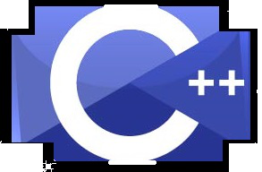

<h1>C plus plus</h1>
  
C++ is multi paradigm programming language that support **lightweight abstractions**

<h2>Paradigms supported by C++</h2>

<ol>
<li>Procedural</li>
<li>Object oriented</li>
<li>Generic programming</li>
</ol>

- Runtime efficiency important in c.
- Zero overhead principle.
  - Classes with constructors & destructors, inheritance, generic programming, functional programming techniques (lambda), etc...
- Direct mapping to hardware.
  - No virtual machine overhead for instruction & native data types
- No language specific support for persistence, garbage collection, or network in C++.
  - Additional support for threading, synchronization and parallelism was added C++11 
- Object code reuse/ Compatibility with C.
  - Storage layout of struct is compatible with C, libraries, system-calls can be encapsulated
- Generic programming **generalizes** software components so that can be easily **reused** in many situations.

